# Project description
Our project is a 2d platformer game, similar to Super Mario. The main character is an Alien whose mission is to collect crystals while trying to get to a space ship. The player will have to get through several levels by running, jumping, avoiding obstacles and watching out for monsters while collecting points. If the player falls or collides against monsters they will start the level from the beginning. By getting to the spaceship (end of level) the player will advance to other levels and, eventually, win the game.

## List of Features
* **Start Screen:** The game begins with a menu that allows the player to start/quit the game or access the settings. The MenuController handles this logic.
  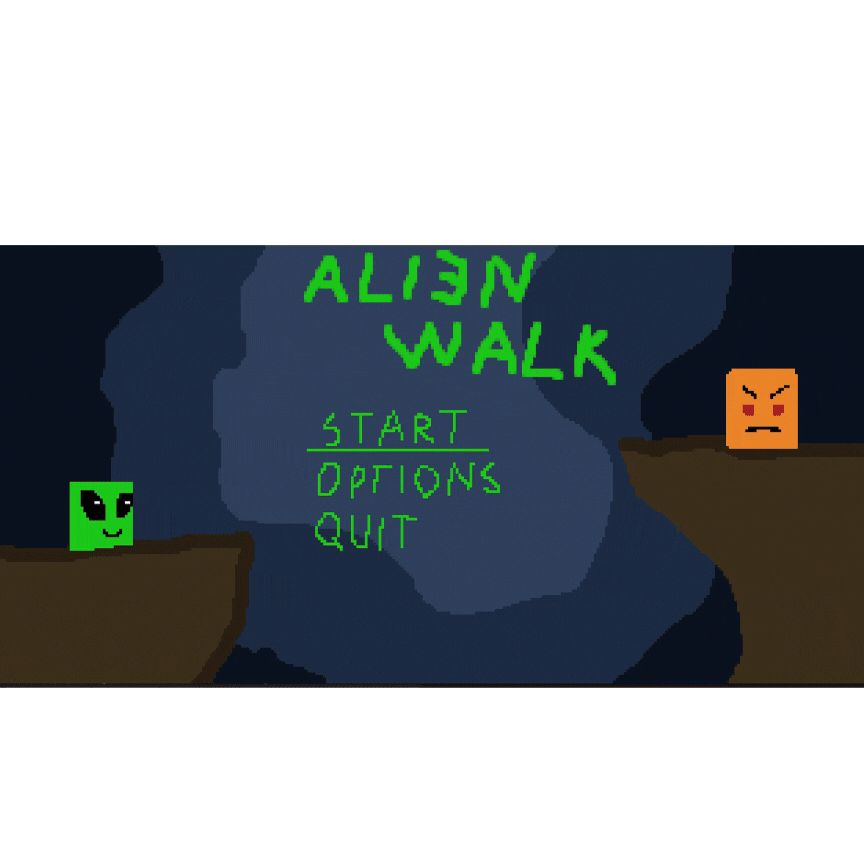
* **Player Movement:** The player controls an alien character using the arrow keys to move left, right, or jump. The Alien class represents the player, and its movement is managed by the GameController.
  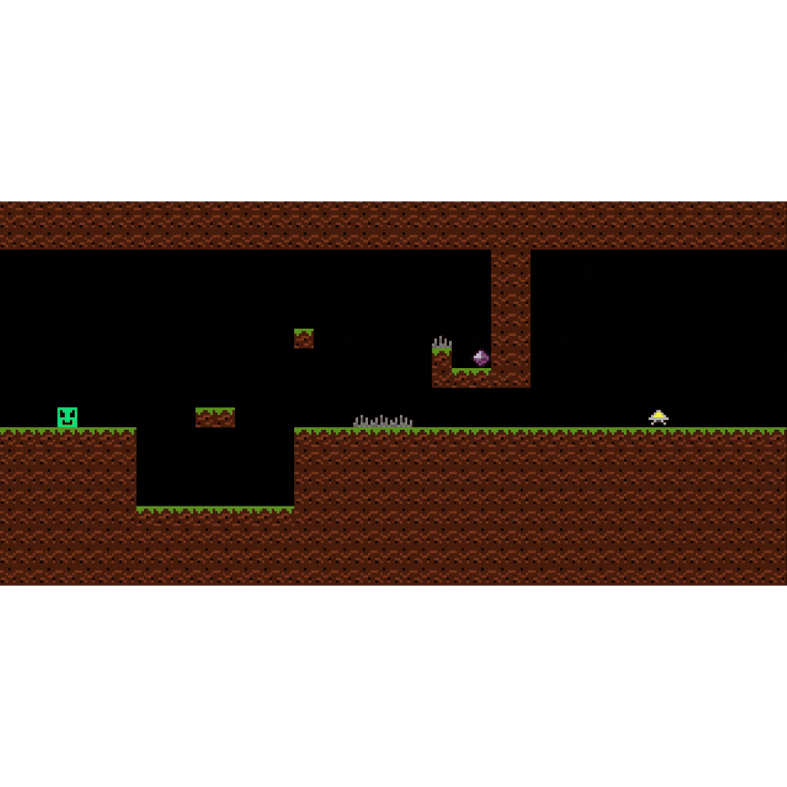
* **Collectible System:** The player collects scientific samples (objects in the game world) to increase their score. These items are handled by the Element class.
  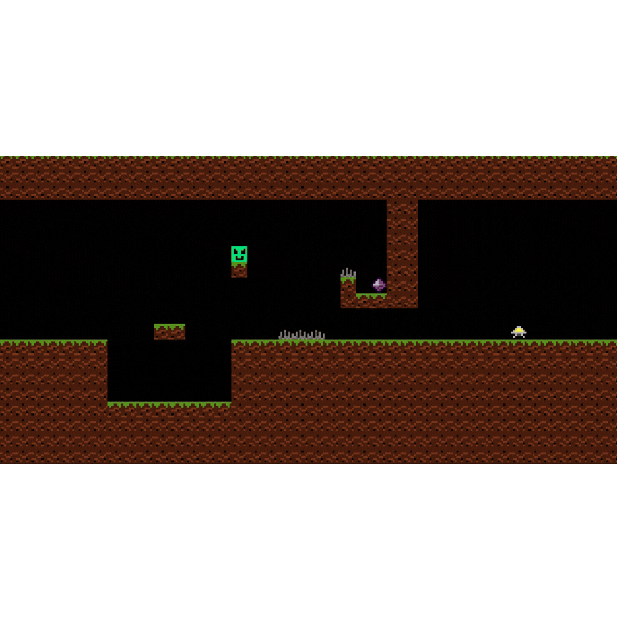
* **Death System:** If the alien character collides with monsters or falls off the map, it dies.
  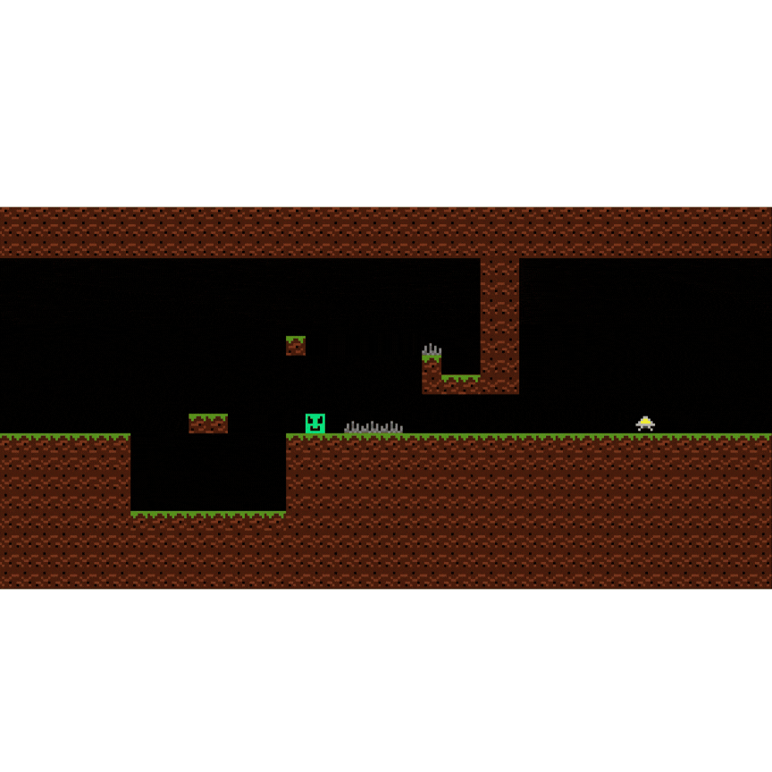
* **Enemies:** There are various enemies, such as monsters and spikes, scattered across levels. These are implemented through the Monster and Spike classes.
  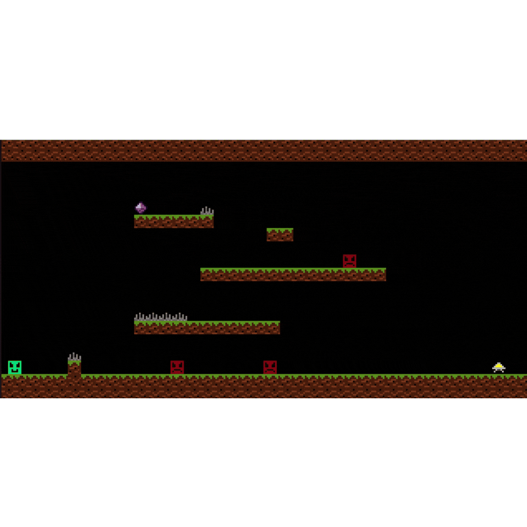
* **Level Maps:** Multiple levels are implemented, each with different environments and obstacles. These levels are defined in text files (Level1.txt, Level2.txt, etc.) and are managed through the Level class. _Trasition to Over Menu:_
  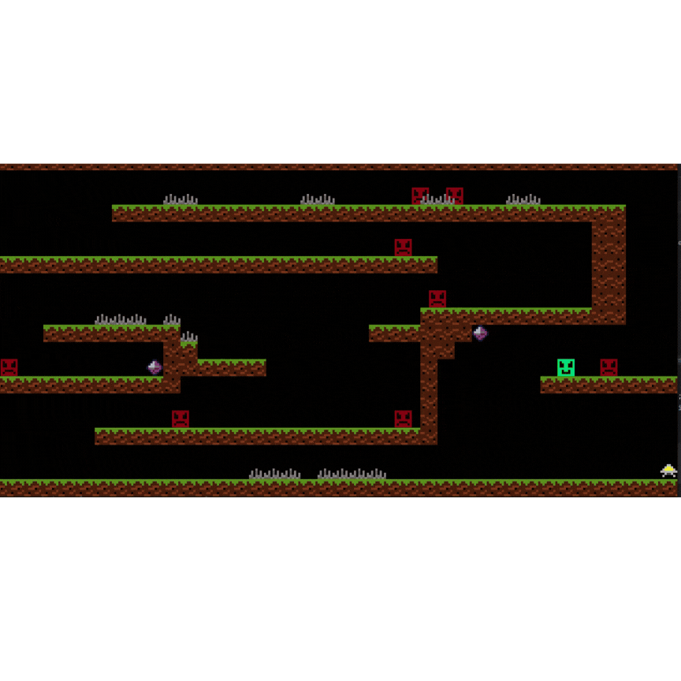

## Project Structure: TODO
We decided to design our game according to MVC design patter. As consequence our code is divided in 4 main blocks ((model, viewer, controller) + state) with each of them responsible for different aspects of a game: 

### Controller:
* Controller: A base class that provides common functionality for all controllers in the game.
* GameController: Controls the main gameplay logic, handling actions like player movement and jumping.
* MenuController: Handles the logic for the game menu, including navigating through options.
### Model:
* Elements: (Alien: Represents the player or an alien character in the game.Element: A general class for game elements.Monster: Represents enemy characters in the game.Position: Defines the coordinates (x, y) of elements in the game world.Tile: Represents the individual tiles that make up the game world.)
* Level: Contains the logic and data for the game levels, including placement of elements and tiles.
* Menu: Manages the game’s menu screen options.
### States:
* GameState: Represents the current state of the game, such as playing or paused.
* MenuState: Handles the menu state, such as when the player is interacting with the menu.
* State: A base class for different game states.
### Viewer:
* GameViewer: Handles the rendering of the game world, displaying the elements to the player.
* MenuViewer: Manages rendering of the game menu on the screen.
* Viewer: A base class for all viewer-related functionality in the game.

## Structure

  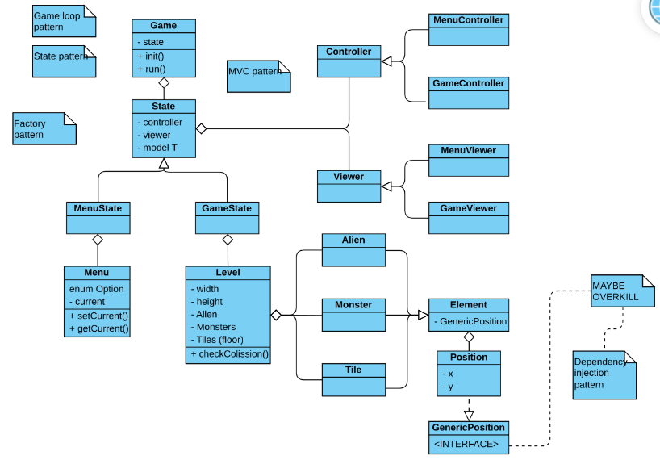

## Main Menu

  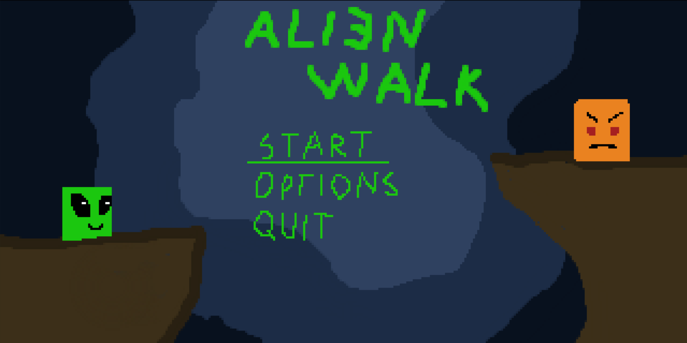

## Gameplay

  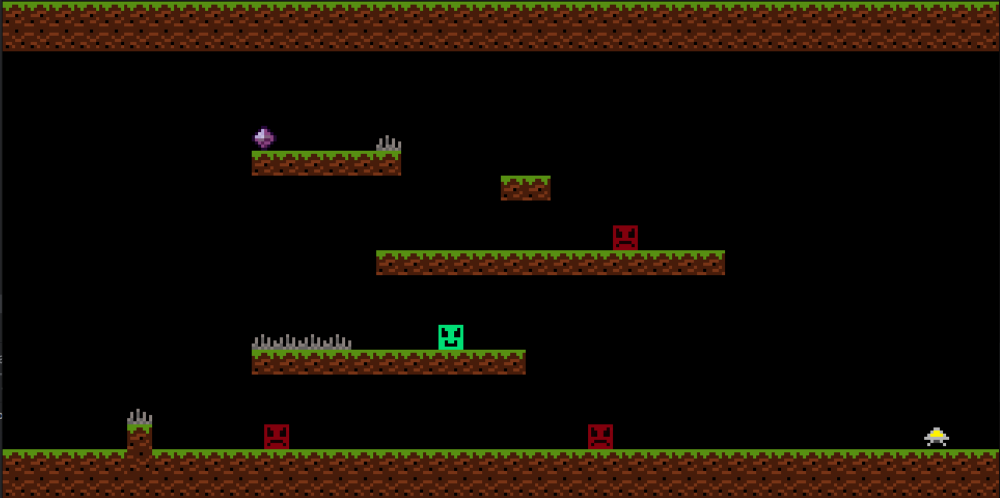

## Over Menu

  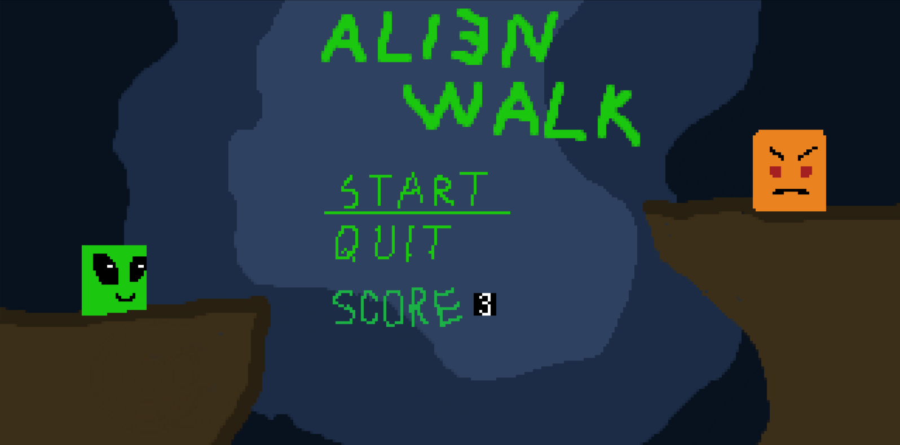

## Coverage Table

  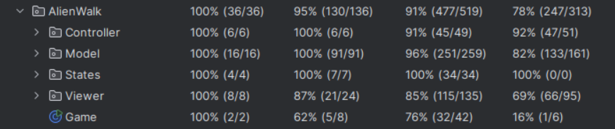

## Design Patterns
**Controller Pattern:** The project follows the Controller design pattern to manage user input and game logic separately.

* **GameController:** Controls the main gameplay, including character movement, jumping, and interactions with enemies and items.
    
* **MenuController:** Manages the logic for the game menu, such as navigating through the options and transitioning to gameplay.

**Model-View-Controller (MVC) Architecture:** The game uses MVC to separate concerns:

* **Model:** Includes classes like Alien, Monster, Level, and Position, which represent the data and logic of the game.
    
* **View:** The GameViewer and MenuViewer classes are responsible for rendering the game world and the menu respectively.
    
* **Controller:** The GameController and MenuController classes handle player input and game state transitions.

**State Pattern:** The project uses the State Pattern to manage different game states, such as when the game is being played or when the menu is open.

* **GameState:** Represents the gameplay state, including player actions and interactions.
    
* **MenuState:** Represents the menu state and transitions between menu options.
    
* **Encapsulation and Modularity:** The Position class encapsulates the coordinates (x, y) of objects in the game, improving code organization and reusability.

## Code Smells
**Large Class Smell:** Some classes, such as GameController, handle multiple responsibilities (player movement, game state, collisions). These could be refactored into smaller, more specialized classes.

**Duplicated Code Smell:** There are likely some duplicated logic, such as for rendering the player and enemies, which could be abstracted into shared methods.

**Tight Coupling:** Classes like GameController and Alien are tightly coupled, and separating concerns further could improve testability and flexibility.

**Long Methods:** Some methods in GameController and GameState might be too long and could be refactored into smaller methods for better readability and maintainability.

## Coverage Report

img

**GameControllerTest -** This test suite validates the functionality of the GameController class, which manages user input and interactions within the game. It uses mocking to isolate dependencies like the Game and Level classes.

**MenuControllerTest -** This test suite verifies the MenuController class, which manages navigation and interactions in the game's menus.

**OverMenuControllerTest -** This test suite focuses on the OverMenuController class, which manages the game over menu, including restarting or exiting the game.

**AlienTest -** Tests the Alien class, which represents the player character and its interactions.

**ElementTest -** This suite tests the Element class, which is the base class for all in-game objects.

**MonsterTest -** Tests the Monster class, which represents enemy characters in the game.

**LevelTest -** This test suite targets the Level class, which represents the game's levels, including elements like enemies, obstacles, and layout.

**MenuTest -** This suite verifies the functionality of the Menu class, which represents the main game menu, including options like starting the game, viewing settings, or exiting.

**OverMenuTest -** This test focuses on the OverMenu class, responsible for handling the game over menu. It includes options such as restarting the game or exiting to the main menu.

**GameStateTest -** This suite tests the GameState class, which tracks the current state of the game, such as active gameplay, paused, or game over states.

**MenuStateTest -** Tests the MenuState class, which handles the state of the game when the menu is active. This includes navigation and menu-specific logic.

**OverMenuStateTest -** This suite verifies the OverMenuState class, managing the state when the game is over and the player is navigating options to restart or exit.

**ElementViewerTest -** This test suite validates the ElementViewer class, which is responsible for rendering individual game elements on the screen.

**GameViewerTest -** This suite tests the GameViewer class, which handles rendering the entire game scene, including all elements, the player, and the background.

**MenuViewerTest -** Tests the MenuViewer class, which is responsible for rendering the main menu and its options.

**OverMenuViewerTest -** This suite validates the OverMenuViewer class, responsible for rendering the game over menu.

**GameTest -** This test suite focuses on the Game class, the central class managing the overall game flow, including transitions, initialization, and termination.
