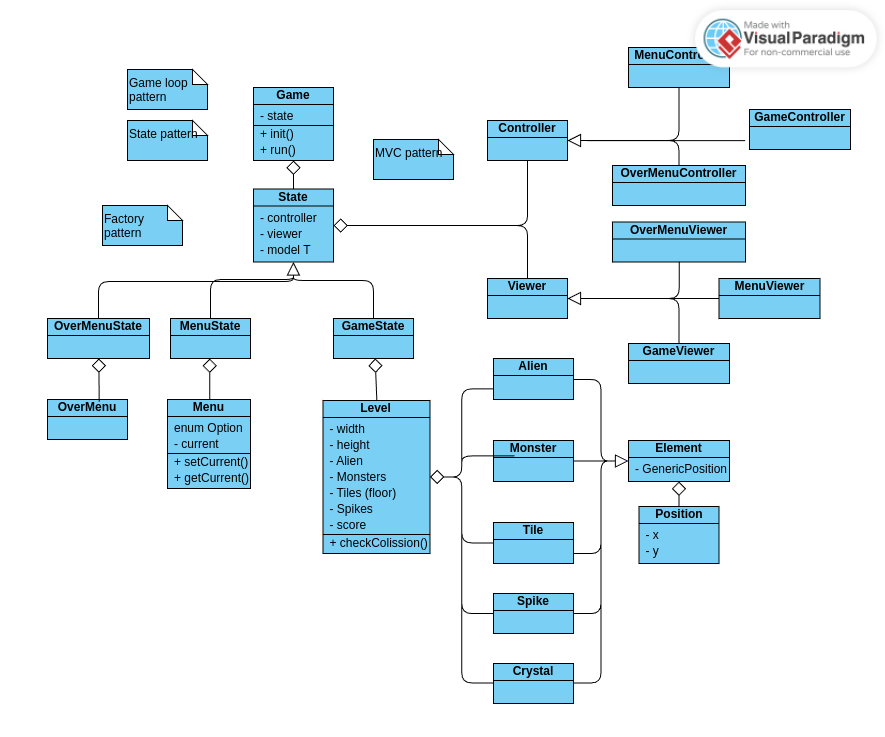

# Project description
Our project is a 2d platformer game, similar to Super Mario. The main character is an Alien whose mission is to collect crystals while trying to get to a space ship. The player will have to get through several levels by running, jumping, avoiding obstacles and watching out for monsters while collecting points. If the player falls or collides against monsters they will start the level drom the beginninge. By getting to the spaceship (end of level) the player will advance to other levels and, eventually, win the game.

## Implemented features
* Start Screen - At the beginning of the game, there will be a menu where the player can start/quit the game or access the settings (no settings for now).
* Player Movement - The player can move the character using the arrow keys and jump.
* Levels - There are 5 levels which are loaded from a .txt files. Each level is harder than the previous one.
* GUI - Each element (ALien, monster, spike...) is nicely drawn.
* Input - Game uses keyListeners making input smooth.
* Enemies - Collision with spikes or moving monsters resets the level.
* Collectible system - during the levels, the player is able collect crystals (points) what improves the score.

## Project Structure: TODO
We decided to design our game according to MVC design patter. As consequence our code is divided in 4 main blocks ((model, viewer, controller) + state) with each of them responsible for different aspects of a game: 

### Controller:
* Controller: A base class that provides common functionality for all controllers in the game.
* GameController: Controls the main gameplay logic, handling actions like player movement and jumping.
* MenuController: Handles the logic for the game menu, including navigating through options.
### Model:
* Elements: (Alien: Represents the player or an alien character in the game.Element: A general class for game elements.Monster: Represents enemy characters in the game.Position: Defines the coordinates (x, y) of elements in the game world.Tile: Represents the individual tiles that make up the game world.)
* Level: Contains the logic and data for the game levels, including placement of elements and tiles.
* Menu: Manages the game’s menu screen options.
### States:
* GameState: Represents the current state of the game, such as playing or paused.
* MenuState: Handles the menu state, such as when the player is interacting with the menu.
* State: A base class for different game states.
### Viewer:
* GameViewer: Handles the rendering of the game world, displaying the elements to the player.
* MenuViewer: Manages rendering of the game menu on the screen.
* Viewer: A base class for all viewer-related functionality in the game.

## Structure

  

## Mockups:

## Mockup 1

  

## Mockup 2

  

## Mockup 3

  

